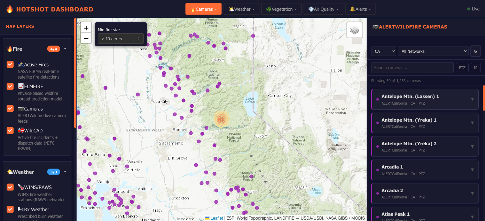

# Hotshot Dashboard 🔥

A unified wildfire situational awareness dashboard that aggregates multiple
fire-monitoring platforms into a single interface — built for hotshot crews,
dispatch centers, and fire agencies.



## Features

- **Interactive map** — topographic basemap with active fires, incidents,
  weather stations, cameras, and vegetation overlays
- **Grouped layer control** — map layers organized into collapsible
  categories (Fire, Weather, Vegetation, Air Quality)
- **Live wildfire cameras** — 1,250+ ALERTCalifornia camera feeds with
  on-map markers and expandable still images
- **Incident markers** — IRWIN fire incidents shown as flame icons with
  name + acreage labels, filterable by minimum fire size
- **Per-platform data panels** — each integration has its own detail panel,
  reachable from category menus in the top bar

## Platforms Integrated

Map layers and data panels are driven by a platform registry
(`frontend/src/config/platforms.js`) — each platform has a backend connector
under `backend/integrations/`.

| Platform | Category | Data Source | API Key |
|---|---|---|---|
| Active Fires | Fire | NASA FIRMS satellite detections | Free key |
| ELMFIRE | Fire | ELMFIRE spread-prediction model | No |
| Cameras | Fire | ALERTCalifornia Live Cameras (ArcGIS) | No |
| WildCAD | Fire | NIFC IRWIN incident/dispatch data | No |
| WIMS / RAWS | Weather | WIMS fire weather stations | Free key |
| Rx Weather | Weather | Prescribed-burn weather stations | Free key |
| Fire Weather | Weather | NWS red flag warnings / watches | No |
| LANDFIRE | Vegetation | USDA/USDI fuel models (30m) | No |
| Vegetation | Vegetation | NASA MODIS NDVI | No |
| Plant ID | Vegetation | AI plant identification | Key |
| Air Quality | Air Quality | EPA AirNow PM2.5 (smoke) | Free key |
| Watch Duty | Alerts | Watch Duty community alerts | No |

> Platforms are modular — new integrations can be added without touching core
> dashboard code. See [docs/adding-platforms.md](docs/adding-platforms.md).

## Project Structure

```
Hotshot_Dashboard/
├── frontend/         # React dashboard (Leaflet maps, Mantine UI, panels)
│   └── src/
│       ├── components/ # UI: Map + layers, Sidebar, per-platform panels
│       └── config/     # Platform registry
├── backend/          # Python FastAPI backend
│   └── integrations/ # Per-platform API connectors
├── data_pipeline/    # SQLite snapshot collector (trajectory history)
├── mcp_server/       # MCP server exposing dashboard data to AI assistants
├── docs/             # Architecture, integration + deployment guides
└── launch.sh         # One-command local launcher
```

## Getting Started

### Prerequisites
- Node.js 18+
- Python 3.12

### Quick start

```bash
./launch.sh
```

This creates the backend virtualenv on first run, starts the FastAPI backend
(`:8000`) and the React frontend (`:3000`), and opens the dashboard. `Ctrl+C`
stops both.

### Manual start

```bash
# Backend
cd backend
python3.12 -m venv .venv
.venv/bin/pip install -r requirements.txt
.venv/bin/uvicorn main:app --reload   # http://localhost:8000

# Frontend
cd frontend
npm install
npm start                             # http://localhost:3000
```

`DEMO_MODE=true` (set in `backend/.env` / `frontend/.env.local`) bypasses
Supabase authentication for local development and agency demos.

## MCP Server

`mcp_server/` exposes the dashboard's wildfire data to AI assistants over the
Model Context Protocol — incidents, fire-weather alerts, RAWS, FIRMS, air
quality, and a composite situational summary. See
[mcp_server/README.md](mcp_server/README.md).

## Data Pipeline

`data_pipeline/` polls IRWIN incidents and NWS fire-weather alerts into a
local SQLite database on a schedule — the trajectory dataset for future ML
work.

## Tech Stack

| Layer | Technology |
|---|---|
| Frontend | React 18, Mantine UI, React-Leaflet, Leaflet.js |
| Backend | Python 3.12, FastAPI, Uvicorn |
| Maps | Leaflet.js + GeoJSON / tile overlays |
| Auth | Supabase (bypassed in `DEMO_MODE`) |
| Storage | SQLite (data pipeline history) |

## Adding a New Platform

See [docs/adding-platforms.md](docs/adding-platforms.md) for step-by-step
instructions on adding a new platform integration.

## Contributing

This project is built to be extended. Each platform lives in its own folder
under `integrations/` — frontend and backend — so teams can work on platforms
independently.
